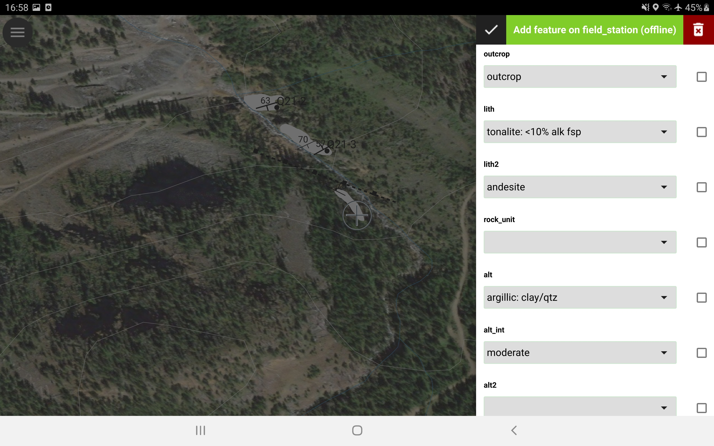

By Rohanna Gibson, Structural Geologist, Terrane Geoscience

Goal
====

To collect new data on bedrock geology and view existing geoscience data
in the field. Geologic mapping is completed using paper maps and/or
digital devices for data collection. The goal is to improve the geologic
mapping workflow by entering data directly in the field, create quality
data with consistent terms, and reference existing geoscience data in
the field.

Project preparation
===================

Prior to starting in QField, a geologic mapping geopackage was designed
to collect vector data including point station, structure, photo, and
sample layers as well as line and polygon layers for contacts, faults,
alteration, and geology. Attribute fields are customized for ease of
data entry and data quality assurance using value maps, defaults (value
or expression), and constraints within the Attributes Form. For example,
the structural layer includes:

**Coordinates**

Fields with default value x and y coordinates from GPS data

**Structure type**

Value map (drop down list) with structural features (e.g., bedding,
cleavage, lineation), set with a "not null" constraint

**Azimuth and dip**

Integers with range set from 0-360 and 0-90, respectively

**Date**

Default value current date and time when feature created

::: {.container .clearer .text-center}

:::

Symbology and labels are customized for each layer, including embedded
SVG symbols for structural features that are rotated with the azimuth
field.

In addition to field data, base maps and historic data are compiled into
geopackages for reference. Base maps include vector topographic data and
raster orthophotos. Raster geophysical data and vector geochemical data
are included if available, as well as historic geologic mapping. Map
themes are designed to quickly toggle between geologic mapping,
geophysics, and geochemistry views.

Data collection
===============

Field data collection includes adding point data for map stations,
structures, photos, and samples. Polygons and lines are drawn freehand
with a stylus or adding vertices manually.

Location and direction of travel are displayed using internal device GPS
(or external GPS device linked via Bluetooth), historic vector and
raster layers can be viewed relative to location. Current and historic
vector layers can be searched and viewed in QField.

Field data are synchronized in QGIS followed by a short data clean up
and verification process. The QGIS project is then exported back to
QField for additional data collection.

::: {.container .clearer .text-center}

:::

Structural data collection may be upgraded with future development of a
geologic compass feature.
<https://github.com/opengisch/QField/issues/1882>

Results
=======

Final geologic maps and analysis are prepared directly from field data
sets with no need to digitize field data. Depending on proficiency and
type of mapping, the QField geologic mapping workflow takes
approximately the same amount of field time as manual (paper) mapping
and drastically reduces office data digitization time. Additionally,
historic data are easily referred to in the field, allowing for real
time interpretation and targeted field work. Maps and attribute tables
can be exported directly from QField or the QGIS project for daily field
updates or communication between working groups.

QField allows for data integrity with customizable attribute fields and
database compatibility. Field data quality assurance can be built in
during project design, ensuring attributes are consistent between users
and reducing human error with constraints and default values.

::: {.container .clearer .text-center}

:::
