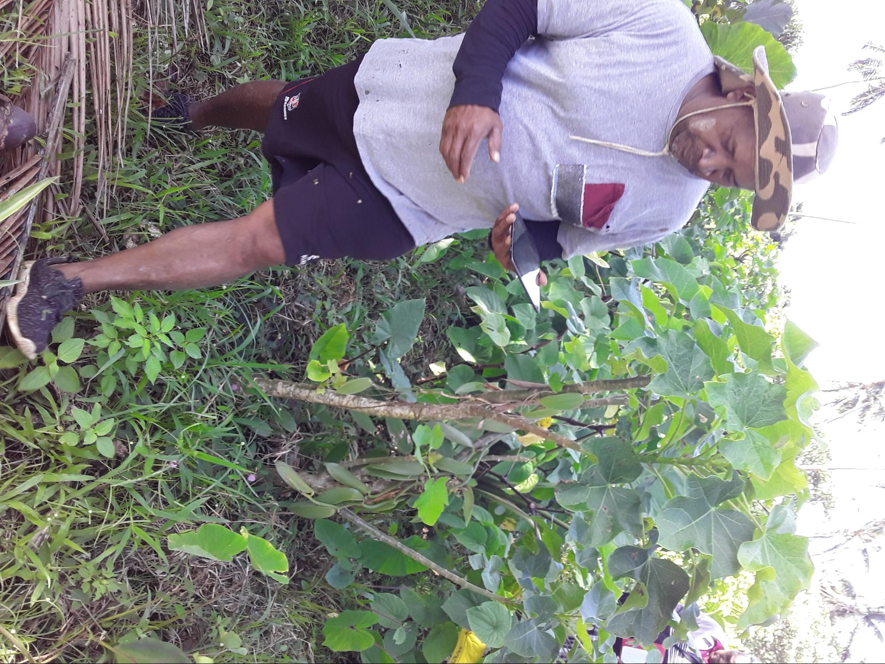
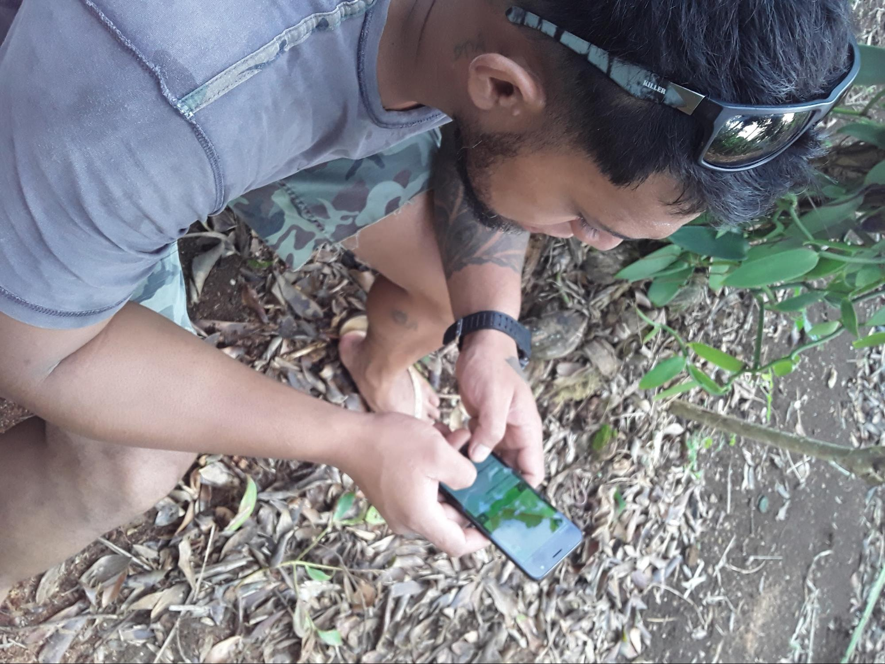

| By Ahi Saipaia (1), Leody Vainikolo (1), and John Duncan (2 and 3)
| 1 Ministry of Agriculture, Forestry, Food, and Fisheries, Government
  of Tonga
| 2 UWA School of Agriculture and Environment, The University of Western
  Australia
| 3 Geography and Planning, The University of Western Australia

A field survey of vanilla plantations on Vava'u, an outer island in the
Kingdom of Tonga, using QField was conducted in May and June 2020 by the
Ministry of Agriculture, Forestry, Food, and Fisheries (MAFF).

Vanilla is an important commercial crop in Vava'u. The purpose of the
survey was to map the extent of vanilla plantations and obtain estimates
of the numbers of vanilla plants, area under vanilla cultivation, and
the proportion of plantations that were managed or neglected. This
information is being used by MAFF on Vava'u for agricultural planning
and decision making.

Extension officers were trained to use QField at MAFF's trial
plantation. Following training, a team of seven extension officers
conducted the survey of vanilla plantations. In total, 140 vanilla
plantations were surveyed. The survey data was processed and visualised
using QGIS and a Shiny dashboard application. QField enabled MAFF staff
to view reference layers of farm boundaries on mobile devices in the
field and map the extent of vanilla plantations within each farm. Maps
of the vanilla plantations and summary statistics reporting the number
of vanilla plantations, total area surveyed, and the estimated yield for
plantations were produced.

Capturing this information using QField enabled MAFF to identify that
large areas under vanilla cultivation were in a neglected management
condition. This data, and the insights generated from it, were used for
reporting at the national level and presentations to senior ministry
staff at the MAFF headquarters on Tongatapu in July 2020. Following the
vanilla survey, there are plans to train MAFF extension staff based on
the main island (Tongatapu) and other island groups to use QField for
crop and farm surveys. The MAFF team in Vava'u are currently using
QField to map areas cultivated by grower groups, the different crops
under cultivation, and problems farmers are facing with cultivation in
all districts on the island. The government is using this information as
part of a process to monitor and evaluate allocated funds that support
farming initiatives and the food security program of the Government.

Acknowledgements
================

The project was funded by the Australian Centre for International
Agricultural Research (ACIAR; ASEM/2016/101).

